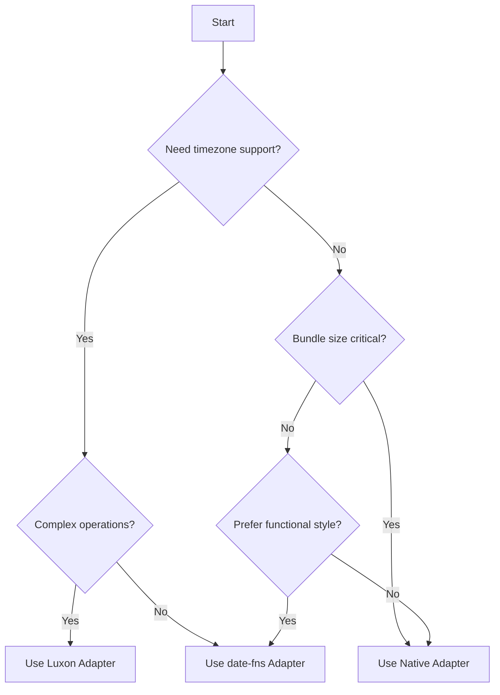

# Date Adapters

useTemporal's adapter system provides a flexible way to use different date libraries while maintaining a consistent API. This guide explains the concept of adapters and how they enable useTemporal to work with any date library.

## What are Date Adapters?

Date adapters are plugins that handle all date operations for useTemporal. They act as a bridge between useTemporal's reactive time units and the underlying date manipulation library of your choice.

```typescript
// Using the default native adapter
const temporal = createTemporal();

// Using a specific adapter
import { luxonAdapter } from "@usetemporal/adapter-luxon";
const temporal = createTemporal({
  adapter: luxonAdapter(),
});
```

## Why Adapters?

The adapter pattern provides several benefits:

1. **Flexibility**: Choose the date library that best fits your needs
2. **Consistency**: Same useTemporal API regardless of the underlying library
3. **Performance**: Use a lightweight adapter for simple apps or a full-featured one for complex requirements
4. **Future-Proof**: Easy to switch adapters as your needs change
5. **Tree-Shaking**: Only include the date functionality you actually use

## How Adapters Work

Every adapter implements the same interface, ensuring consistent behavior:

```typescript
interface DateAdapter {
  // Core operations
  now(): Date;
  startOf(date: Date, unit: TimeUnit): Date;
  endOf(date: Date, unit: TimeUnit): Date;

  // Manipulation
  add(date: Date, amount: number, unit: TimeUnit): Date;
  subtract(date: Date, amount: number, unit: TimeUnit): Date;
  set(date: Date, value: number, unit: TimeUnit): Date;

  // Information
  get(date: Date, unit: TimeUnit): number;
  diff(date1: Date, date2: Date, unit: TimeUnit): number;

  // Formatting
  format(date: Date, format: string): string;
  parse(dateString: string, format: string): Date;
}
```

## Available Adapters

useTemporal provides four official adapters:

| Adapter                           | Package                         | Use Case                             |
| --------------------------------- | ------------------------------- | ------------------------------------ |
| [Native](/api/adapter-native)     | Built-in                        | Simple apps, minimal dependencies    |
| [date-fns](/api/adapter-date-fns) | `@usetemporal/adapter-date-fns` | Functional programming, tree-shaking |
| [Luxon](/api/adapter-luxon)       | `@usetemporal/adapter-luxon`    | Complex timezone handling, i18n      |
| [Temporal](/api/adapter-temporal) | `@usetemporal/adapter-temporal` | Future-proof, standard-compliant     |

## Choosing an Adapter

### Quick Decision Guide



### Comparison Matrix

| Feature          | Native | date-fns   | Luxon     | Temporal  |
| ---------------- | ------ | ---------- | --------- | --------- |
| Bundle Size      | ~0KB   | ~2-20KB    | ~70KB     | Varies    |
| Timezone Support | Basic  | With addon | Excellent | Excellent |
| i18n Support     | Basic  | Good       | Excellent | Excellent |
| Date Math        | Basic  | Good       | Excellent | Excellent |
| Performance      | Fast   | Fast       | Good      | Good      |
| Dependencies     | None   | date-fns   | luxon     | Polyfill  |

## Using Adapters

### Installation

Each adapter is a separate package to minimize bundle size:

```bash
# Default (includes native adapter)
npm install usetemporal

# With specific adapter
npm install @usetemporal/core @usetemporal/adapter-luxon luxon
```

### Basic Usage

All adapters work the same way with useTemporal:

```typescript
import { createTemporal } from "@usetemporal/core";
import { luxonAdapter } from "@usetemporal/adapter-luxon";

// Create temporal with adapter
const temporal = createTemporal({
  adapter: luxonAdapter(),
});

// Use the same API regardless of adapter
const year = useYear(temporal);
const months = temporal.divide(year, "month");
```

### Adapter Configuration

Many adapters accept configuration options:

```typescript
// Luxon with timezone
const temporal = createTemporal({
  adapter: luxonAdapter({
    zone: "America/New_York",
  }),
});

// date-fns with locale
import { fr } from "date-fns/locale";
const temporal = createTemporal({
  adapter: dateFnsAdapter({
    locale: fr,
  }),
});
```

## Creating Custom Adapters

You can create adapters for any date library:

```typescript
import type { DateAdapter } from "@usetemporal/core";
import { MyDateLibrary } from "my-date-lib";

export function myAdapter(): DateAdapter {
  return {
    now: () => new MyDateLibrary(),
    startOf: (date, unit) => date.startOf(unit),
    endOf: (date, unit) => date.endOf(unit),
    // ... implement all required methods
  };
}
```

See the [Custom Adapter Guide](/guide/custom-adapter) for detailed instructions.

## Switching Adapters

One of the key benefits is the ability to switch adapters without changing your code:

```typescript
// Development
const temporal = createTemporal(); // Native adapter

// Production
const temporal = createTemporal({
  adapter: luxonAdapter(), // Better timezone support
});

// Your code remains the same!
const day = useDay(temporal);
const hours = temporal.divide(day, "hour");
```

## Performance Tips

1. **Start Simple**: Use the native adapter until you need specific features
2. **Lazy Load**: Dynamically import adapters for better code splitting
3. **Tree-Shake**: With date-fns, only the used functions are bundled
4. **Cache Instances**: Reuse temporal instances when possible

```typescript
// Lazy loading example
async function createTemporalWithLuxon() {
  const { luxonAdapter } = await import("@usetemporal/adapter-luxon");
  return createTemporal({ adapter: luxonAdapter() });
}
```

## Next Steps

- Explore individual [adapter documentation](/api/adapter-native)
- Learn about [reactive time units](/guide/reactive-time-units)
- See [framework examples](/examples/vue) using different adapters
- Create a [custom adapter](/guide/custom-adapter) for your date library
